# Fashion MNIST Image Classification & Visualisation
[](https://www.python.org/downloads/release/python-374/)
[](https://www.gnu.org/licenses/gpl-3.0) 
[](https://app.codacy.com/manual/insectatorious/fashion_mnist_demo?utm_source=github.com&utm_medium=referral&utm_content=insectatorious/fashion_mnist_demo&utm_campaign=Badge_Grade_Dashboard)
[](https://coveralls.io/github/insectatorious/fashion_mnist_demo)
[](https://travis-ci.org/github/insectatorious/fashion_mnist_demo)
[](https://travis-ci.org/github/insectatorious/fashion_mnist_demo)


This repository contains sample code to train and visualise a simple [Convolutional Neural Network](https://en.wikipedia.org/wiki/Convolutional_neural_network) to classify the [Fashion MNIST dataset](https://github.com/zalandoresearch/fashion-mnist) using [TensorFlow 2.x](https://www.tensorflow.org).
Whilst the network architecture is a simple [Sequential](https://www.tensorflow.org/api_docs/python/tf/keras/Sequential) model ([details below](#model-structure)), the goal is to highlight the ability to visualise the model as it classifies input images. 


👉 [**Live demo**](http://projector.tensorflow.org/?config=https://raw.githubusercontent.com/insectatorious/fashion_mnist_demo/master/tensorboard_assets/config_github.json) of embedding vectors on Tensorboard.

## Table Of Contents

-   [Summary](#summary)
-   [Usage](#usage)
    -   [Requirements](#requirements)
    -   [Training](#training)
    -   [Classifying New Images](#classifying-new-images)
    -   [Exporting Tensorboard Assets](#exporting-tensorboard-assets)
-   [Model Structure](#model-structure)
-   [Network Layer Visualisations](#network-layer-visualisations)
    -   [Transformations To Input Image](#transformations-to-input-image)
    -   [Class Activation Map](#class-activation-map)
    -   [Confusion Matrix](#confusion-matrix)
    -   [Layer Activations](#layer-activations)
    -   [Global Average Pooling & Dense Activations](#global-average-pooling--dense-activations)
-   [Embedding Vectors](#embedding-vectors)
    -   [Principal Component Analysis (PCA)](#principal-component-analysis-pca)
    -   [t-Distributed Stochastic Neighbour Embedding (t-SNE)](#t-distributed-stochastic-neighbour-embedding-t-sne)
    -   [Custom Projections](#custom-projections-tensorboard-only)
-   [Live Demo](#play-with-the-vectors-yourself)
-   [Further Reading](#further-reading)
-   [Experimental](#experimental)
-   [Licence](#licence)

## Summary

-   A Convolutional Neural Network is trained (see [train.py](./fashion_mnist_vis/train.py)) to classify images from the Fashion MNIST dataset. The main features showcased here: 
    -   [ModelCheckpoint callback](https://www.tensorflow.org/api_docs/python/tf/keras/callbacks/ModelCheckpoint?hl=en) saves only  when validation loss (`val_loss`) improves
    -   [EarlyStopping callback](https://www.tensorflow.org/api_docs/python/tf/keras/callbacks/EarlyStopping) stops training when validation loss (`val_loss`) stops improving 
    -   [Dropout](https://www.tensorflow.org/api_docs/python/tf/keras/layers/Dropout?hl=en) to limit overfitting
    -   [GlobalAveragePooling](https://www.tensorflow.org/api_docs/python/tf/keras/layers/GlobalAveragePooling2D?hl=en) to simplify feature extraction along with spatial invariance
    -   [Tensorboard](https://www.tensorflow.org/tensorboard?hl=en) logging of Images, Histograms and Distributions along with Scalars like `accuracy` & `loss`
-   Classification of a new image (passed in using a command line argument or one of the sample images located in [sample_images](./sample_images)) using a trained model (:point_up:) using [classify.py](./fashion_mnist_vis/classify.py).
-   Exporting test images from dataset for visualisation in Tensorboard Projector

Details about the dataset can be found [here](https://github.com/zalandoresearch/fashion-mnist). Briefly, each image is `28 x 28` pixels and is one of ten different types of fashion categories (Shirt, Dress, Sneakers etc). The classification task is to train a model that can take one of these images as input and classify it into one of the existing categories. After training several visualisations are generated to see the model's learning. 

These visualisations cover:
-   [Transformations to input image](#transformations-to-input-image): transforming the input image before it is passed as input to the network
-   [Class activation map](#class-activation-map): a heatmap overlaid on the input image to see where the network is paying 'Attention'
-   [Confusion matrix](#confusion-matrix): a matrix showing the model's performance on the different classes compared to the true classes
-   [Layer activations](#layer-activations): output of each feature map of each layer in the network for a single input
-   [Live Demo](http://projector.tensorflow.org/?config=https://raw.githubusercontent.com/insectatorious/fashion_mnist_demo/master/tensorboard_assets/config_github.json): exporting embedded vectors for each input in the test set for visualistion and analysis in Tensorboard Projector

## Usage

A Python virtual environment (see [this guide](https://docs.python-guide.org/dev/virtualenvs/) for more information) is recommended when installing Python libraries. This prevents system-wide installs and allows each environment to function as a sandbox. 

### Requirements

A full list of requirements can be found in [`requirements.txt`](./requirements.txt). Additionally `graphviz` is required for plotting the model's structure (this is an OS level install). The main dependencies of note are:

-   Python 3.7
-   TensorFlow 2.x
-   pillow (used for image loading, greyscale conversions and resizing)
-   pydot & graphviz (used for plotting model structure)

All dependecies can be installed by running the following on the command line:
```bash
## execute from project root folder
pip install -r requirements.txt
```
Note: [`graphviz`](https://www.graphviz.org/) needs to be installed on the system

### Training

Simply run (from the project root path):

```bash
PYTHONPATH=fashion_mnist_vis python fashion_mnist_vis/train.py
```
The trained model will be saved in the project root with the filename `model.h5`. 

### Classifying New Images

To classify one of the sample images:

```bash
PYTHONPATH=fashion_mnist_vis python fashion_mnist_vis/classify.py sample_images/black_bag.jpg --saved_model model.h5 --save_plots
```

Here the saved model (`model.h5`) and image (`black_bag.jpg`) can be substituted as needed. All visualisations will be stored  in the `visualisations` folder. To avoid plotting each time and only classify the image, remove the `--save_plots` argument from the command. As the model expects a `28 x 28` image, the input image will be resized to `28 x 28`.

Note: Input images in the training set are square with the object centered. For best results, new images should be similar. 

### Exporting Tensorboard Assets

Embedding vectors ([see below for more details](#embedding-vectors)) are exported for visualising in Tensorboard Projector. 

**First** export assets using:

```bash
PYTHONPATH=fashion_mnist_vis python fashion_mnist_vis/tensorboard_visualise.py --saved_model model.h5
```

This will store necessary files in the [`tensorboard_assets`](./tensorboard_assets) folder. 

**Second**, start a [CORS](https://developer.mozilla.org/en-US/docs/Web/HTTP/CORS) server using the provided [`tensorboard_assets/serve_assets.py`](./tensorboard_assets/serve_assets) script:

```bash
cd tensorboard_assets
python serve_assets.py
```
This will start a simple webserver to serve the exported embedding vector data (with CORS enabled) on port `8000`.

**Finally**, go to <http://projector.tensorflow.org/?config=http://localhost:8000/config.json> in a browser to view the embedded vectors in Tensorboard Projector. 

## Model structure

| Summary | Graph Diagram |
| ------- | ------------- |
A simple, sequential Convolutional Neural Network with [Batch Normalisation](https://en.wikipedia.org/wiki/Batch_normalization), a [Global Average Pooling](https://alexisbcook.github.io/2017/global-average-pooling-layers-for-object-localization/) layer (for [Attention](https://papers.nips.cc/paper/7181-attention-is-all-you-need.pdf)) and [Dropout](https://en.wikipedia.org/wiki/Convolutional_neural_network#Dropout). Note there are no fully connected layers in this network. This model achieved an accuracy of 92.07% on the test set. It is expected that a model with skip connections as popularised by the [ResNet-50](https://arxiv.org/abs/1512.03385) architecture would improve the classification capabilities. However the visualisation of such a network with merge layers would be more difficult and harder to grok for people starting out. | 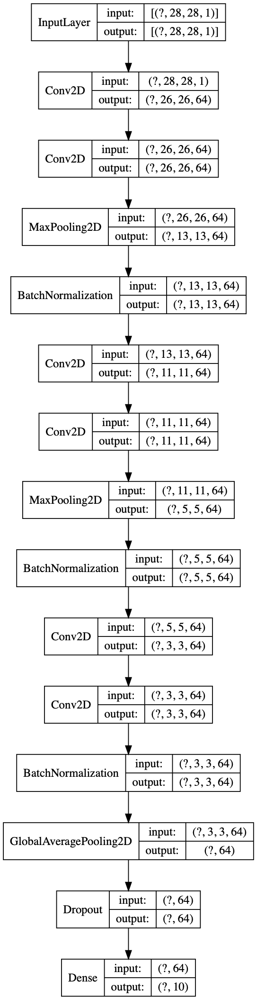

## Network Layer Visualisations

### Input Image
A black handbag from Argos is chosen as our input - [KIPLING Black Art Mini Handbag - One Size](https://www.argos.co.uk/product/tuc135958689)

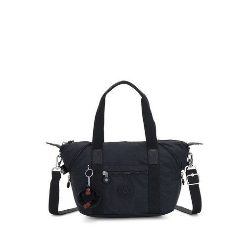

Model classification: `Bag` with a score of `0.9213`.

Image is from an Argos product page so out of the train and test datasets. This is a crucial validation of the model's ability to generalise and work on data that's not restricted to the dataset itself. CNNs have tremendous memorisation capabilities and seeing its ability to correctly classify data that is from a different source (but still in line with the training dataset's patterns) is fundamental to proving its effectiveness.

### Transformations To Input Image
The model only accepts greyscale images with a resolution of `28 x 28` so all input images will need to be 
-   converted to greyscale
-   resized to `28 x 28`

before they can be sent to the model.

### Class Activation Map
A class activation map for a particular category indicates the discriminative image regions used by the CNN to identify that category. 
The procedure for generating a CAM (from [Learning Deep Features for Discriminative Localization](http://cnnlocalization.csail.mit.edu/)) is illustrated below:


_Source: <http://cnnlocalization.csail.mit.edu/>_

#### Fashion MNIST CNN Class Activation Map

| Input To Model | Class Activation Map | 
| -------------- | -------------------- |
 | 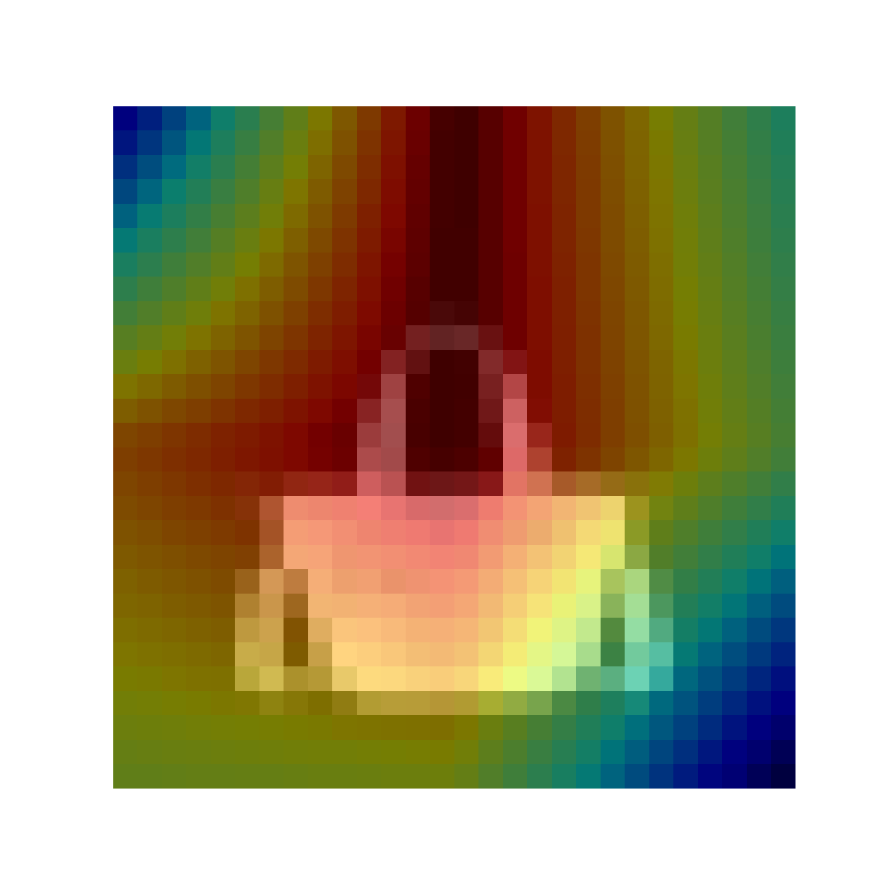 

Looking at the activation map :thinking:, it appears the model is paying attention to the *handle of the bag* in making it's classification (along with the absence of anything above the handle).

### Confusion Matrix

([From Wikipedia](https://en.wikipedia.org/wiki/Confusion_matrix)) a confusion matrix is a specific table layout that allows visualization of the performance of a classification algorithm.
It allows for a comparison of the model's ability to correctly, or incorrectly, classify certain classes.
Rows represent the true class labels whilst the columns represent the model's predictions. 

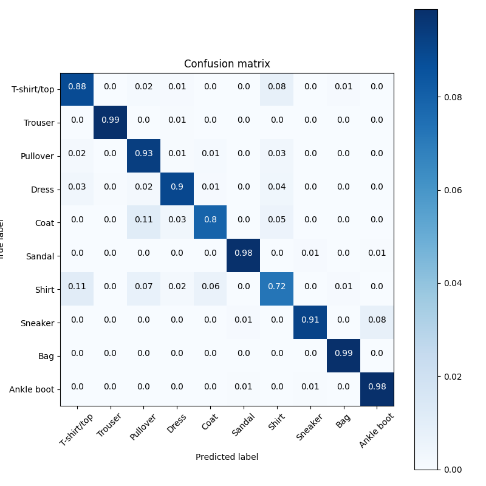

This matrix provides visibility on the classes the model is 'struggling' to classify correctly.
In this case the 'Shirt' & 'Coat' classes have the worst accuracy (72% & 80% respectively).
A large number (11%) of 'Shirt' images are misclassified as 'T-shirt/top'.
Whilst understandable as the distinction between these classes is not as stark as the other classes, the model is still expected to perform reasonably on these classes.
Conversely, the 'Trousers' & 'Bag' classes have the best accuracy (99%).
[Data augmentation](https://bair.berkeley.edu/blog/2019/06/07/data_aug/) is likely to help improve the model's performance, especially on the former pair of classes.

### Layer Activations
The transformed image (as detailed above) passes through the network and each of the feature maps in each layers extracts some features from it. The lower layers of the network (CNN Layer 1 & 2 below :point_down:) typically end up as edge detectors. Specifically they look for certain kinds of edges that are of 'use' to the layers deeper in the network. Layers futher down in the network use these features to activate when certain criteria is met. For example, the first few layers of feature maps might activate on a pair of curved edges near the top middle of the image (like seen in the handle of a bag. Higher layers will then activate when seeing these features to indicate that there is strong probability that a bag's handle is visible in the image. Eventually the final few layers will activate to indicate a 'Bag' class if all the collection of features most closely match a bag (a handle, a solid shape in the middle etc). 

#### CNN Layer Activations

| CNN Layer 1 | CNN Layer 2 |
|   :---:   |   :---:   |
| 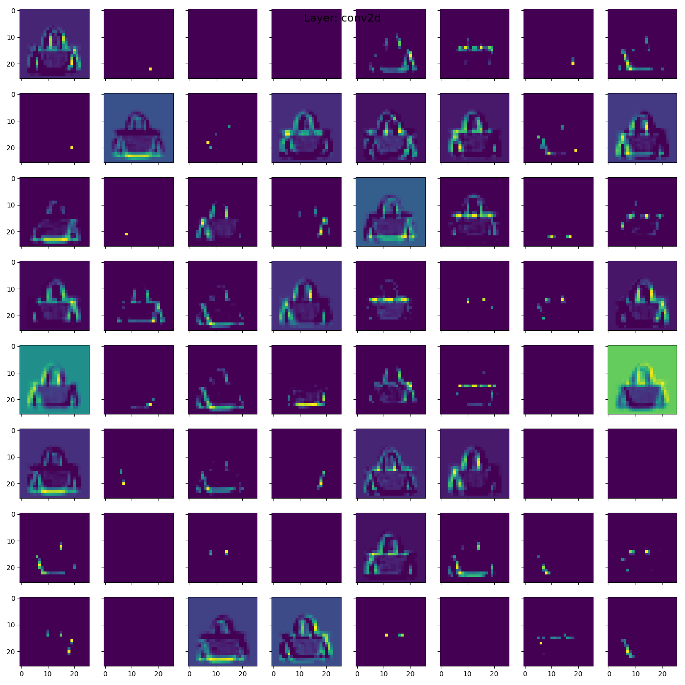 |  |

:point_up: We see 64 feature maps in the two layers above showing different activations for the bag. Invariably, some of these will be blank as they only activate when detecting edges of other classes (like 'Ankle Boot' or 'Sneaker'). 

:point_down: The last few convolutional layers (5 & 6) do not bear any recognisable resemblance to the input image, however they are showing activations on groups of features. 

| CNN Layer 5 | CNN Layer 6 |
|   :---:   |   :---:   |
| 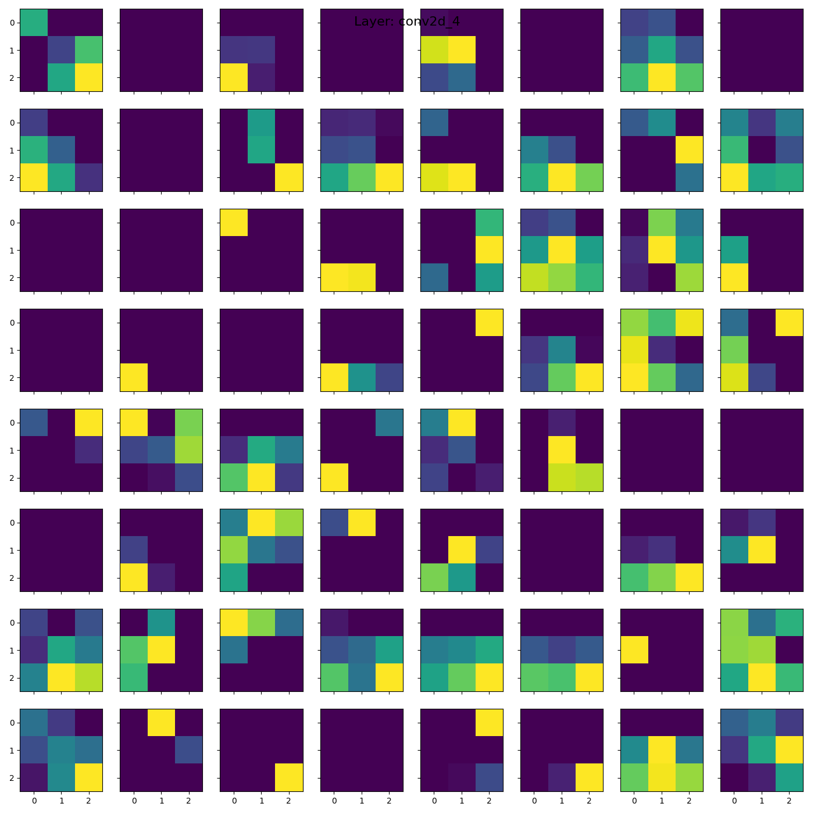 | 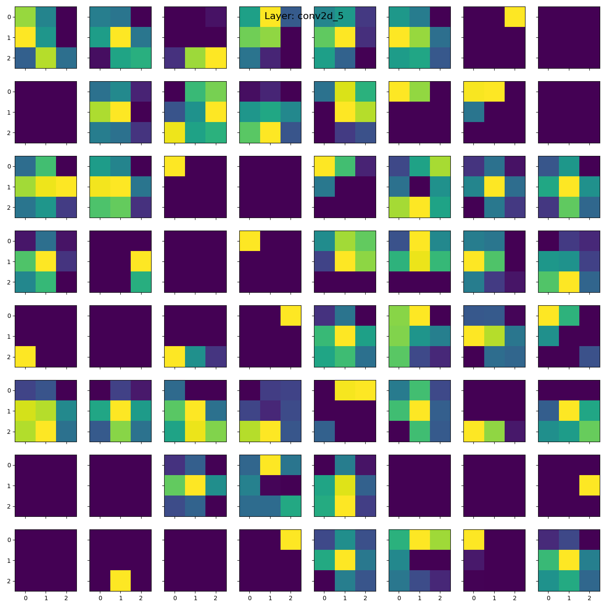 |

#### Global Average Pooling & Dense Activations

The activations from the previous layer are averaged using a [Global Average Pooling](https://alexisbcook.github.io/2017/global-average-pooling-layers-for-object-localization/) layer. Activations from this layer provide the *embedding vector* (see next section) that the model uses to make the final classification. 

| Global Average Pooling | Dense (Final) |
|   :---:   |   :---:   |
|  |  |

Note: the Dropout layer is not visualised as it is only used whilst training the network. When making a prediction the network does not perform any function. 

## Embedding Vectors
An [embedding vector](https://developers.google.com/machine-learning/crash-course/embeddings/video-lecture) provides a low-dimensional representation of an input datapoint. In the case of this model each input datapoint can be thought of a `28 x 28 = 784` dimensional vector. As this image passes through the network's layers, it is transformed until it is ultimately a `64` dimension vector. This is the penultimate layer in the network and contains enough information about the datapoint to allow the final layer to perform the classification. 

### Decision Boundaries

The following visualisations are aimed to examining these vectors to understand how the model is 'representing' the images. As we cannot visualise a 64 dimension vector directly, we have to perform some kind of dimensionality reduction to get it down to two or three dimensions.

Each datapoint represents a single image. It's important to focus on the relative positioning of the data instead of the absolute values. 
For instance, the three dimensions don't carry any special meaning, they simply represent the most appropriate dimensions to visualise the data (the definition of what constitutes 'most appropriate' is down to each individual algorithm). 
When examining the visualisations, it is useful to see the separation of the different classes. 
Classes that have a clear [hyperplane](https://en.wikipedia.org/wiki/Hyperplane) separating them are easier for the model to classify (in a way the creation of the hyperplane is the direct result of the training process). 
These hyperplanes can be viewed as distinct [decision boundaries](https://en.wikipedia.org/wiki/Decision_boundary).
However, where a clear hyperplane is not visisble (like between 'Coat' and 'Shirt') the model will struggle to accurately distinguish between the different classes. 


Source: [Dealing with nonlinear decision boundaries](https://subscription.packtpub.com/book/big_data_and_business_intelligence/9781783980284/6/ch06lvl1sec34/dealing-with-nonlinear-decision-boundaries)


In order to get a sense of the higher dimensional positioning of the datapoints (in this case 64D), a few algorithms are used to provide a mapping between the higher (64D) and lower (3D) dimensions whilst retaining certain characteristics about the datapoints. 

### Principal Component Analysis (PCA)
[PCA](https://en.wikipedia.org/wiki/Principal_component_analysis) is a simple, powerful algorithm to reduce a high dimensional vector to low dimenions. In the images below, the `64` dimension embedding vector is reduced to 3 dimensions and plotted by Tensorboard. A quick and easy starting point for analysing high dimensional data it does struggle to deal with non-linearity in the higher dimensions. 

Image 1 | Image 2
----|----
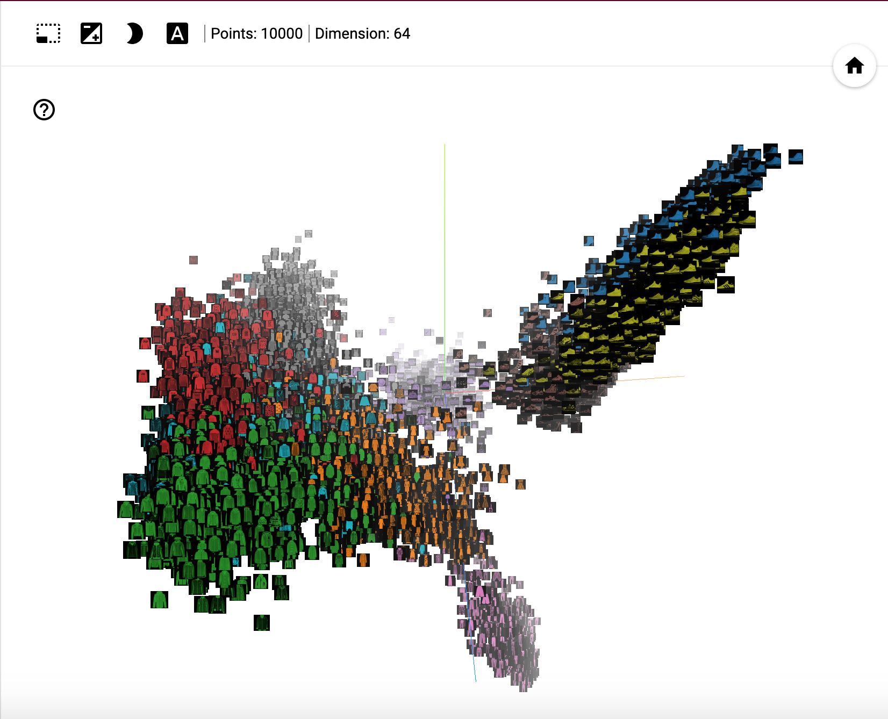 | 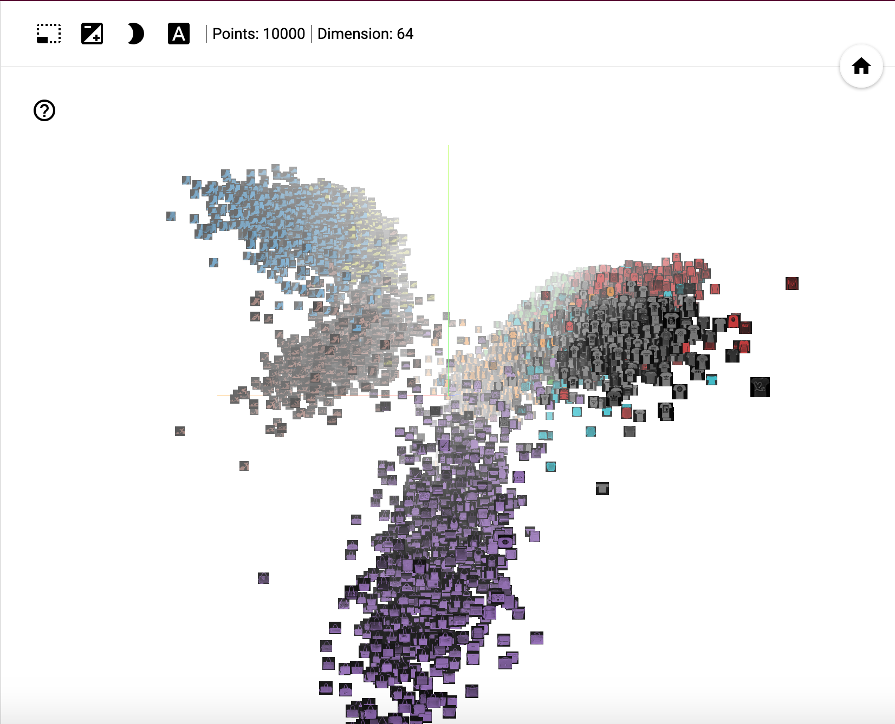 


### t-Distributed Stochastic Neighbour Embedding (t-SNE)
[t-SNE](https://en.wikipedia.org/wiki/T-distributed_stochastic_neighbor_embedding) is a non-deterministic algorithm to visualise high dimenional data in lower dimensions whilst retaining spatial information. See [this excellent article on how to effectively use t-SNE](https://distill.pub/2016/misread-tsne/). It's important to note that unlike PCA, t-SNE is not a generalised function that takes high dimensional data and output low dimensional equivalents. Instead, it provides a mapping for known datapoints only. 

Image 1 | Image 2
---|---
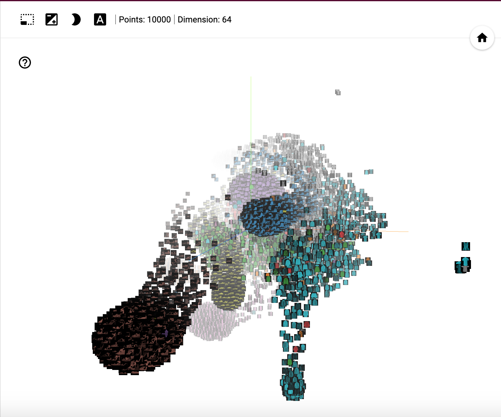 | 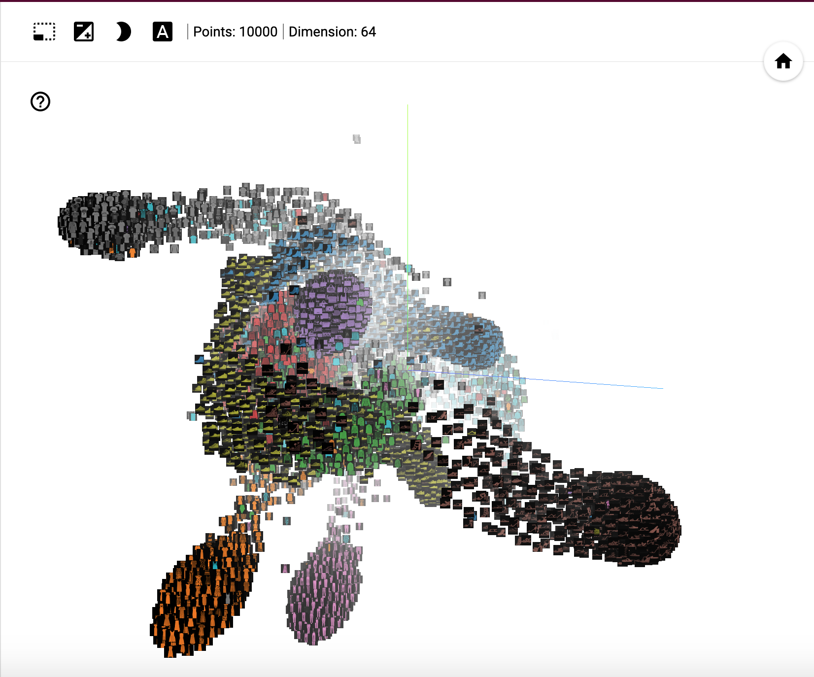 

### Custom Projections (Tensorboard Only)
Tensorboard allows users to map projections for datapoints matching certain criteria against each other. 
In the following examples datapoints matching the 'Sneaker' vectors are projected to the left and those matching 'Ankle' are projected to the right. This can be interpreted as, the more to the left or right a data point is, the more similar it is to a 'Sneaker' or 'Ankle' datapoint. Similarly, 'Bag' and 'Coat' are projected up and down respectively. 

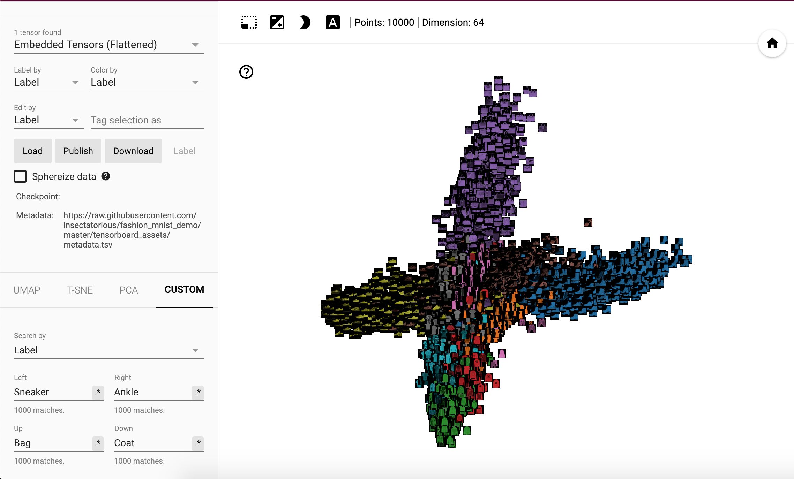

The image below :point_down: shows an example of 'Sandal' images highlighted. Most of them are closer to the right making them similar to 'Ankle Boot' but a number of them are also seen on the left making these similar to 'Sneakers'.

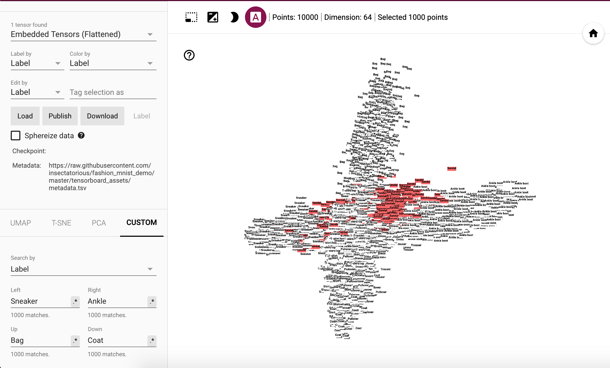

## Play With The Vectors Yourself!
View the embedded vectors on [Tensorboard](http://projector.tensorflow.org/?config=https://raw.githubusercontent.com/insectatorious/fashion_mnist_demo/master/tensorboard_assets/config_github.json). Works best in Chrome or Firefox. 

The vectors visualised here are exported using the model `model.h5`, saved in this repository. 

## Further Reading

-   [Applied Deep Learning - Part 4: Convolutional Neural Networks](https://towardsdatascience.com/applied-deep-learning-part-4-convolutional-neural-networks-584bc134c1e2) - _Towards Data Science_ 
-   [Conv Nets: A Modular Perspective](https://colah.github.io/posts/2014-07-Conv-Nets-Modular/) - _Chris Olah's Blog_ 
-   [Understanding Convolutions](https://colah.github.io/posts/2014-07-Understanding-Convolutions/) - _Chris Olah's Blog_ 
-   [Neural Networks, Manifolds, and Topology](https://colah.github.io/posts/2014-03-NN-Manifolds-Topology/) - _Chris Olah's Blog_
-   [Transfer Learning With A Pretrained ConvNet](https://www.tensorflow.org/tutorials/images/transfer_learning) - _Tensorflow  Official Guide_

## Experimental

Code with interesting results is located in the [./fashion_mnist_vis/experimental](./fashion_mnist_vis/experimental) folder. 

For instance using the webcam to classify a livestream using the trained Fashion MNIST model.
See the [Experimental README](./fashion_mnist_vis/experimental/README.md) for more information. 

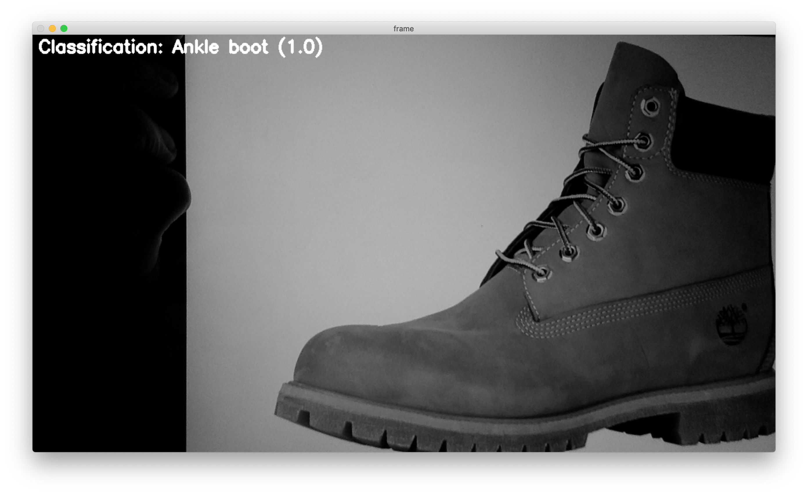
## Licence
[GNU General Public License v3.0](https://www.gnu.org/licenses/gpl-3.0.en.html)

Permissions of this strong copyleft license are conditioned on making available complete source code of licensed works and modifications, which include larger works using a licensed work, under the same license. Copyright and license notices must be preserved. Contributors provide an express grant of patent rights. 
