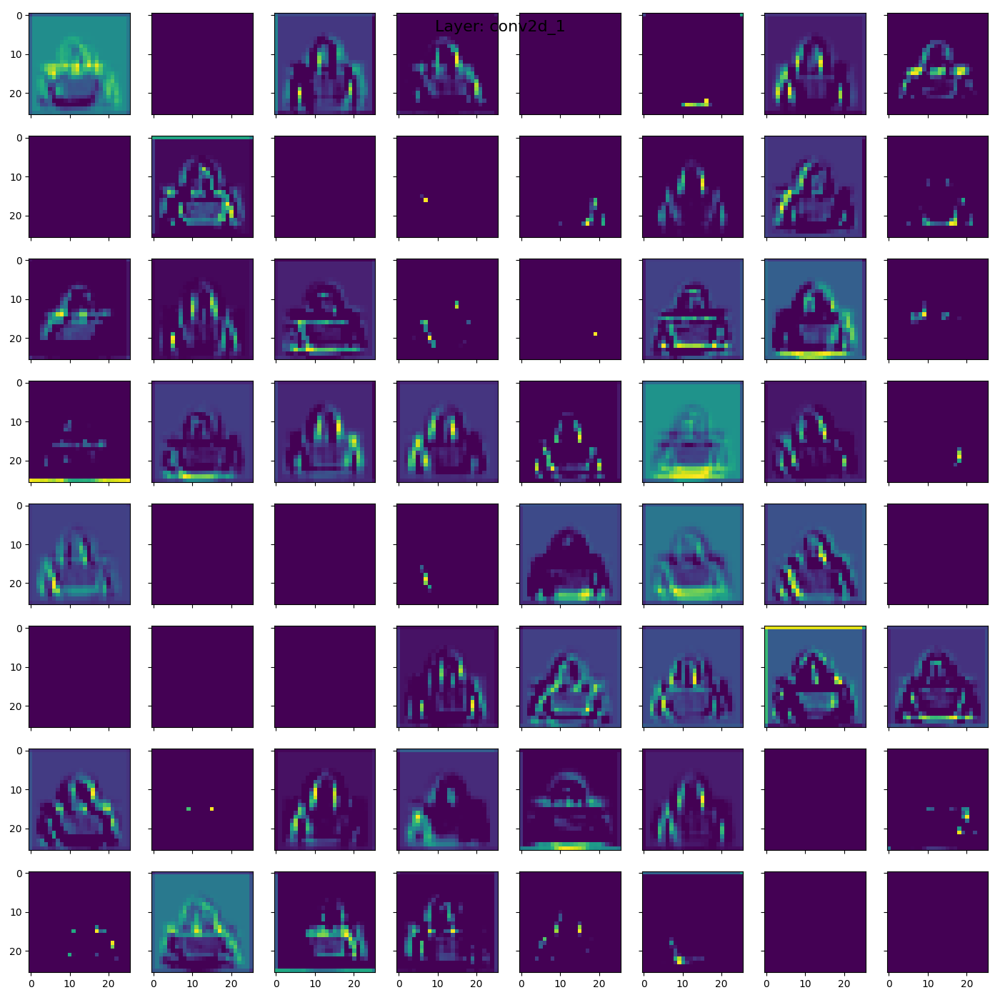

# Fashion MNIST Image Classification & Visualisation

This repository contains sample code to train and visualise a simple [Convolutional Neural Network](https://en.wikipedia.org/wiki/Convolutional_neural_network) to classify the [Fashion MNIST dataset](https://github.com/zalandoresearch/fashion-mnist) using [TensorFlow 2.x](https://www.tensorflow.org).
Whilst the network architecture is a simple [Sequential](https://www.tensorflow.org/api_docs/python/tf/keras/Sequential) model ([details below](#model-structure)), the goal is to highlight the ability to visualise the model as it classifies input images. 

👉 [Live demo](http://projector.tensorflow.org/?config=https://raw.githubusercontent.com/insectatorious/fashion_mnist_demo/master/tensorboard_assets/config_github.json) of embedding vectors on Tensorboard.

Details about the dataset can be found [here](https://github.com/zalandoresearch/fashion-mnist). Briefly, each image is `28x28` pixels and is one of ten different types of fashion categories (Shirt, Dress, Sneakers etc). The classification task is to train a model that can take one of these images as input and classify it into one of the existing categories. 

These visualisations cover:
- [Transformations to input image](#transformations-to-input-image): transforming the input image before it is passed as input to the network
- [Layer activations](#layer-activations): output of each feature map of each layer in the network for a single input
- [Class activation map](#transformations-to-input-image): a heatmap overlaid on the input image to see where the network is paying 'Attention'
- [Live Demo](http://projector.tensorflow.org/?config=https://raw.githubusercontent.com/insectatorious/fashion_mnist_demo/master/tensorboard_assets/config_github.json): exporting embedded vectors for each input in the test test for visualistion and analysis in Tensorboard Projector

# Model structure

Summary | Graph Diagram
----|----
A simple, sequential Convolutional Neural Network with [Batch Normalisation](https://en.wikipedia.org/wiki/Batch_normalization), a [Global Average Pooling](https://alexisbcook.github.io/2017/global-average-pooling-layers-for-object-localization/) layer (for [Attention](https://papers.nips.cc/paper/7181-attention-is-all-you-need.pdf)) and [Dropout](https://en.wikipedia.org/wiki/Convolutional_neural_network#Dropout). Note there are no fully connected layers in this network. This model achieved an accuracy of 92.07% on the test set. It is expected that a model with skip connections as popularised by the [ResNet-50](https://arxiv.org/abs/1512.03385) architecture would improve the classification capabilities. However the visualisation of such a network with merge layers would be more difficult and harder to grok for people starting out. | 

# CNN Layer Feature Map Activations

### Input image

Model classification: `Bag` with a score of `0.9213`.

Image is from an Argos product page so out of the train and test datasets. 

### Transformations to input image
The model only accepts greyscale images with a resolution of `28x28` so all input images will need to be 
- converted to greyscale
- resized to `28x28`
before they can be sent to the model.

Input To Model | Class Activation Map 
---------------|---------------------
 |  

Looking at the activation map it appears the model is paying attention to the handle of the bag in making it's classification (along with the absence of anything above the handle).
### Layer activations

CNN Layer 1 | CNN Layer 2
------------|-------------
 | 

### Embedding vectors
An [embedding vector](https://developers.google.com/machine-learning/crash-course/embeddings/video-lecture) provides a low-dimensional representation of an input datapoint. In the case of this model each input datapoint can be thought of a `28 x 28 = 784` dimensional vector. As this image passes through the network's layers, it is transformed until it is ultimately a `64` dimension vector. This is the penultimate layer in the network and contains enough information about the datapoint to allow the final layer to perform the classification. 

The following visualisations are aimed to examining these vectors to understand how the model is 'representing' the images. As we cannot visualise a 64-dim vector directly, we have to perform some kind of dimensionality reduction to get it down to two or three dimensions.

#### Principal component analysis (PCA)
[PCA](https://en.wikipedia.org/wiki/Principal_component_analysis) is a simple but powerful algorithm to reduce a high dimensional vector to low dimenions. In the images below, the `64-dim` embedding vector is reduced to 3 dimensions and plotted by Tensorboard. A quick and easy starting point for analysing high dimensional data it does struggle to deal with non-linearity in the higher dimensions. 

Image 1 | Image 2
----|----
 |  

#### t-Distributed Stochastic Neighbour Embedding (t-SNE)
[t-SNE](https://en.wikipedia.org/wiki/T-distributed_stochastic_neighbor_embedding) is non-deterministic algorithm to visualise high dimenional data in lower dimensions whilst retaining spatial information. See t[his excellent article](https://distill.pub/2016/misread-tsne/) on how to effectively use t-SNE. 
Image 1 | Image 2
---|---
 |  

#### Custom projections (Tensorboard only)
Image 1 | Image 2
---|---
 |  

## Play with the vectors yourself!
View the embedded vectors on [Tensorboard](http://projector.tensorflow.org/?config=https://raw.githubusercontent.com/insectatorious/fashion_mnist_demo/master/tensorboard_assets/config_github.json). Works best in Chrome or Firefox. 

# Licence
GNU General Public License v3.0
